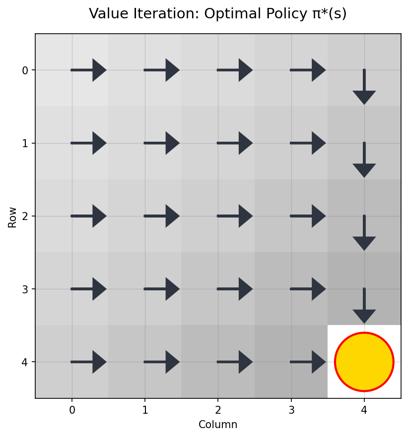
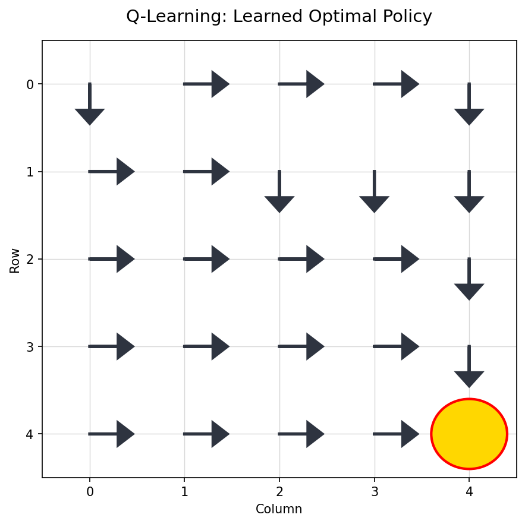
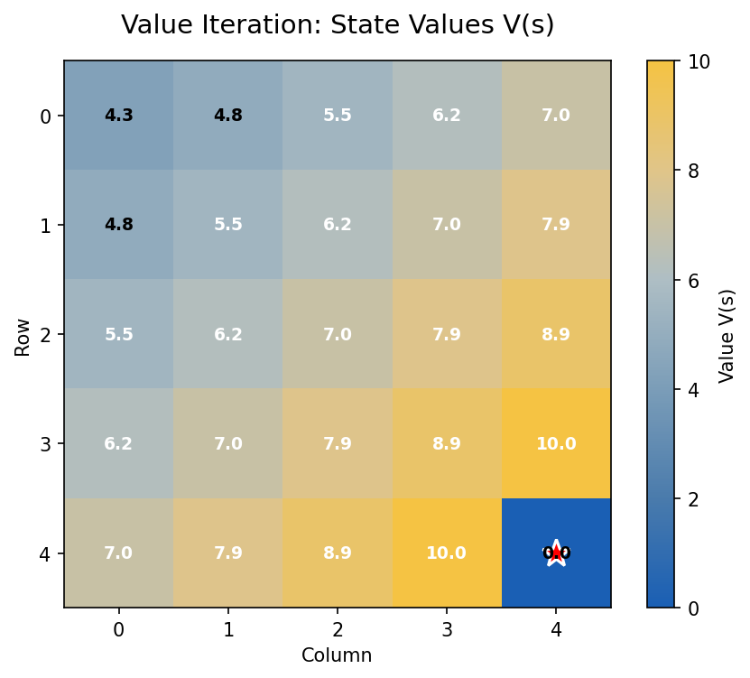
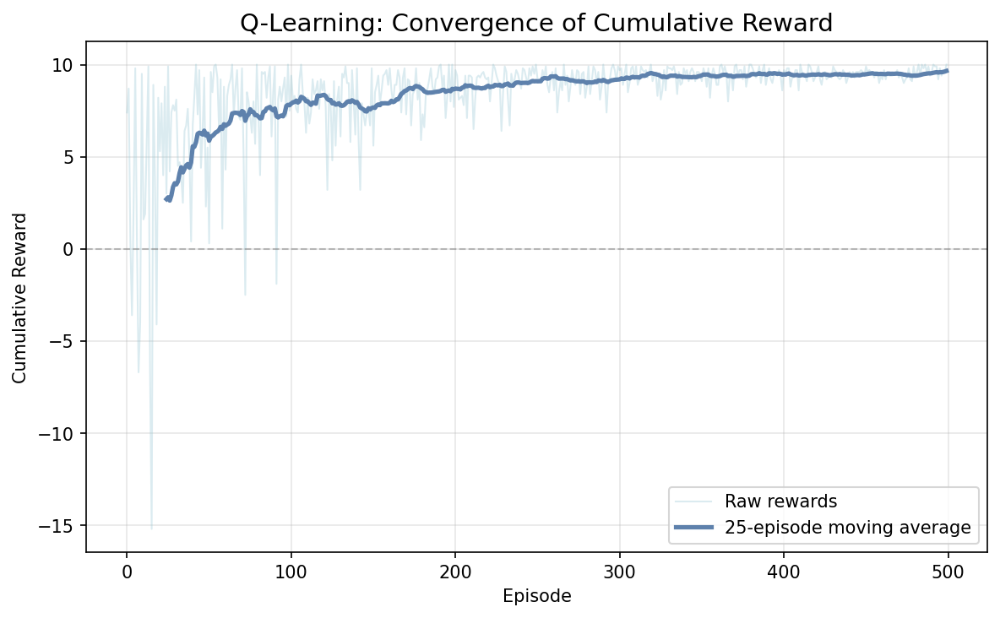

# RL GridWorld: Value Iteration vs Q-Learning

> Model-Based Planning vs Model-Free Learning in a 5×5 Environment



*Optimal policy computed offline using full MDP knowledge (Value Iteration)*



*Policy learned through environment interaction without MDP knowledge (Q-Learning)*

---

##  Environment Specification
- **Grid Size**: 5×5 deterministic gridworld
- **Goal State**: `(4, 4)` with **+10 reward** (terminal)
- **Step Penalty**: -0.1 per action
- **Actions**: 4-directional movement (↑, →, ↓, ←)
- **Transition Dynamics**: 
  - Valid moves: Deterministic state transition
  - **Invalid moves**: Agent *stays in place* (0 reward)
- **Discount Factor**: γ = 0.9

---
---

## Execute Experiments

```bash
# Run Value Iteration
python experiments/run_value_iteration.py

# Run Q-Learning
python experiments/run_q_learning.py
```

## Output Files
All visualizations saved to `results/` directory:

```plaintext
results/
├── vi_values.png          # Value function heatmap
├── vi_policy.png          # Optimal policy arrows
├── ql_policy.png          # Learned policy arrows
└── ql_learning_curve.png  # Convergence plot```
```
## Value Iteration Results

### Value Function Heatmap



## Q-Learning Results


### Learning Curve


## Project Structure 
``` 
rl-gridworld/
├── README.md               # This file 
├── requirements.txt 
├── src/
│   ├── grid_environment.py # Custom 5x5 grid with unique boundaries 
│   ├── value_iteration.py  # Model-based planning 
│   └── q_learning.py       # Model-free learning 
├── experiments/
│   ├── run_value_iteration.py 
│   └── run_q_learning.py
```
